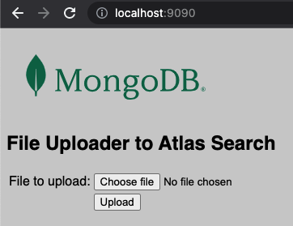
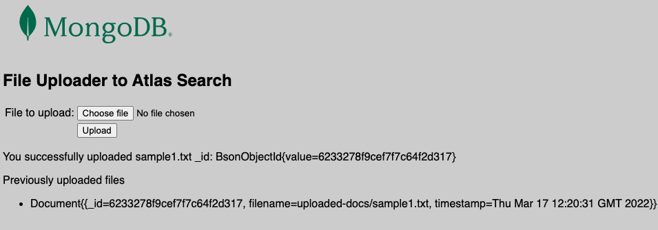
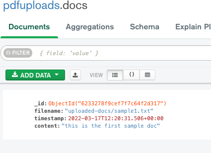

<h1 align="center">Doc to Mongo</h1>
<p align="center">A simple Spring Boot app that allows you to upload a document file (eg pdf, word), the backend then extracts the data and puts it into MongoDB.</p>

## 📋 Details
This is a small project which allows you to extract data from documents such as PDF, word, txt etc, and make them queryable
and searchable from MongoDB. When combined with Atlas Search, you can perform full Lucene text search on the document.

**UPDATE**

The most recent version also extracts the person, location and organisationentities from documents and adds them as an embedded object of arrays.

NB: this is designed as an example of what *you can do* with MongoDB, Atlas etc. It is not a production system, and it has not been tested
against every single document type and for performance.

## 📦 Installation

### Requirements
- Java 11
- Maven 3
- A MongoDB Atlas instance 

### Project Structure
This repo contains 2 main folders:
* [doc-to-mongo-service](doc-to-mongo-service) - a Spring Boot Java application that allows you to upload a file, extracts information (via Apache Tika)
  and then uploads it to a MongoDB instance

## 💻 How to use
1. Make sure you have a MongoDB Atlas cluster running - you do not need Atlas and can run MongoDB locally, but you won't then be able
to use the Atlas Search features.
2. Start the [doc-to-mongo-service](doc-to-mongo-service) instance. See the project README for more details.
3. Navigate to [localhost:9090](localhost:9090) (default ports if running locally), select a pdf of txt document to upload.



4. Upload said document - if successful then you should get back the committed `ObjectId`



5. Navigate to your Atlas Cluster either via Compass, Atlas UI or simple the mongosh
6. Run queries against your documents



7. If you have enabled Atlas search on the documents, you can run full text search on your uploaded documents eg:
```js
db.docs.aggregate([
  {$search: {
    index: 'default',
    text: {
      query: 'sample',
      path: 'content'
    }
  }
}])
```
returns...
```js
{ 
  _id: ObjectId("6233278f9cef7f7c64f2d317"),
  filename: 'uploaded-docs/sample1.txt',
  timestamp: 2022-03-17T12:20:31.506Z,
  content: 'this is the first sample doc'
}
```
8. Run more complicated queries as required


